# 笔记

> 说明：本文件主要记录推荐系统理论学习、算法理解和评测方法，不作为当前 Django 项目的成品实现文档。项目现状、运行方式与工程结构请以 `README.md` 为准。

## 引入

生活案例：京东电商推荐、社交媒体推荐、广告推荐等。

核心意义是摆出来的东西要让用户真正觉得喜欢，会点进去。

推荐系统：在海量数据里发现潜在的关联。

## 概述

### 目的及应用

- 推荐系统是信息过载所采用的措施，面对海量的数据信息，从中快速推荐出符合用户特点的物品。解决一些人的“选择恐惧症”;面向没有明确需求的人。
- 解决如何从大量信息中找到自己感兴趣的信息。
- 解决如何让自己生产的信息脱颖而出，受到大众的喜爱。

- 让用户更快更好的获取到自己需要的内容
- 让内容更快更好的推送到喜欢它的用户手中
- 让网站(平台)更有效的保留用户资源
- 好的推荐系统——三方共赢

- 推荐系统最有名的就是电商（亚马逊）和电影（网飞公司），个性化推荐比热门推荐还要重要

### 基本思想

**知你所想，精准推送&物以类聚&人以群分**

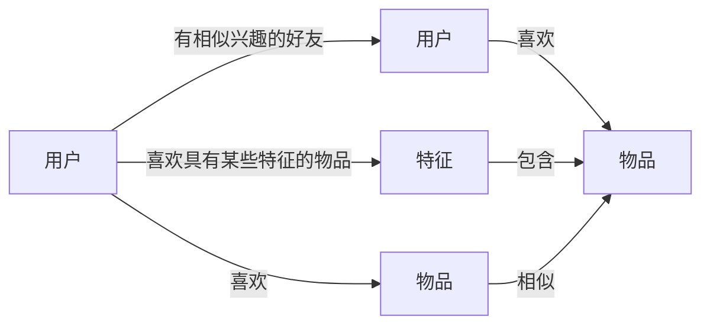

基于特征来推荐，前提是知道用户想要什么特征。实际上用户可能也不知道自己喜欢什么。解决方案 1：用户以前喜欢什么物品，特征提取，找到相似的物品（用户没看过的）。解决方案 2：找跟用户类似的用户，其他人喜欢什么，就给他推什么。

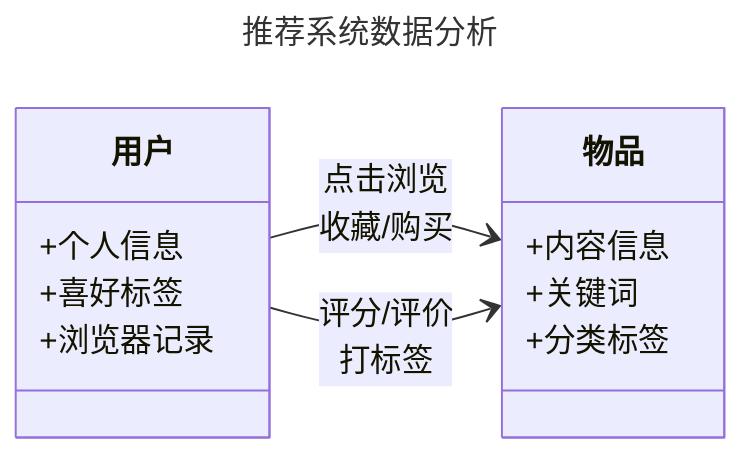

1. 要推荐物品或内容的元数据，例如关键字，分类标签，基因描述等;
2. 系统用户的基本信息，例如性别，年龄，兴趣标签等
3. 用户的行为数据，可以转化为对物品或者信息的偏好，根据应用本身的不同，可能包括用户对物品的评分，用户查看物品的记录，用户的购买记录等。这些用户的偏好信息可以分为两类：

- 显式的用户反馈:这类是用户在网站上自然浏览或者使用网站以外，显式的提供反馈信息，例如用户对物品的评分，或者对物品的评论。（**业务系统获取**）
- 隐式的用户反馈:这类是用户在使用网站是产生的数据，隐式的反应了用户对物品的喜好，例如用户购买了某物品，用户查看了某物品的信息等等。（**日志收集**）

### 分类

- 根据实时性分类
  - 离线推荐
  - 实时推荐
- 根据推荐是否个性化分类
  - 基于统计的推荐（热门，大家都喜欢）
  - 个性化推荐
- 根据推荐原则分类
  - 基于相似度的推荐（人以类聚物以群分）
  - 基于知识的推荐（什么样的人，就给他推固定的）
  - 基于模型的推荐（机器学习，基于知识/规则，这些规则就是从算法里算出来的）
- 根据数据源分类
  - 基于人口统计学的推荐（数据来源于用户，隐私问题严重）
  - 基于内容的推荐
  - 基于协同过滤的推荐（行为数据）

## 算法

### 人口统计学（人以群分）

核心思想是：具有相似人口统计特征（年龄、性别、地域、职业等）的用户，往往具有相似的兴趣偏好。

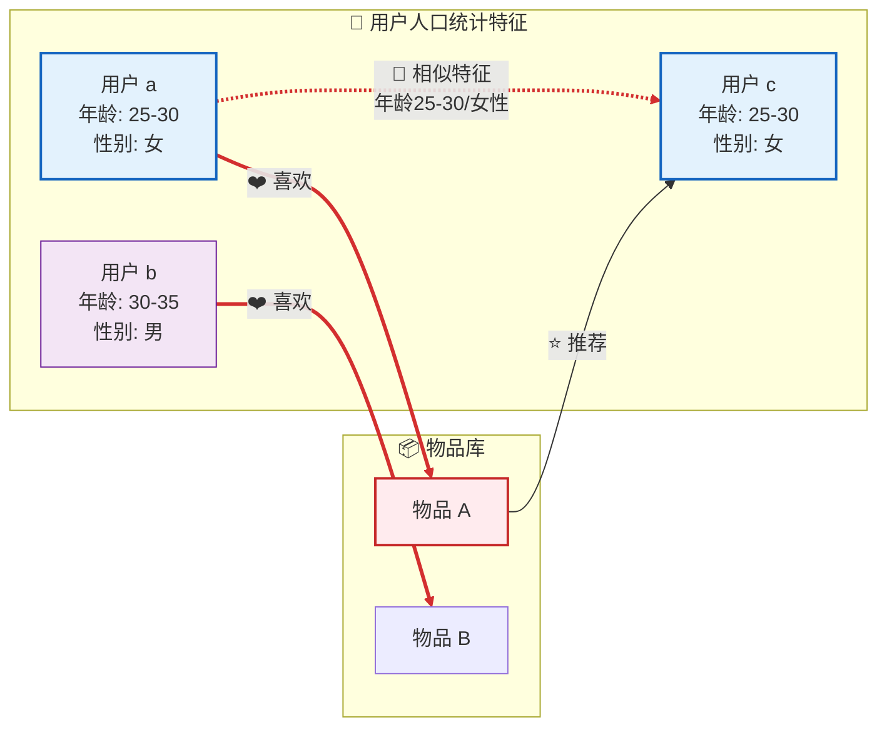

- 优点：

1. 冷启动友好：新用户注册时只需填写基本信息即可产生推荐，无需历史行为数据
2. 简单易实现：规则明确，无需复杂的协同过滤计算
3. 可解释性强：可以向用户解释"因为与您同年龄段的女性都喜欢这个"

- 局限性：

1. 粒度粗糙：同一年龄段、同性别的人兴趣可能差异很大（如用户 a 可能喜欢美妆，用户 c 可能喜欢运动）
2. 无法发现细粒度偏好：难以捕捉个体独特的兴趣点
3. 刻板印象风险：过度依赖统计特征可能产生偏见（如默认"女性都喜欢粉色"）

- 实际应用场景
  这种算法常用于新用户首次进入平台时的默认推荐，或作为混合推荐系统的补充策略，常与协同过滤、内容推荐结合使用，以解决冷启动问题。

### 基于内容（物以类聚）

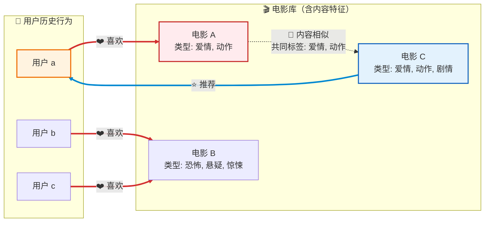

- 优点：

1. 无需其他用户数据：只需要当前用户的历史行为和物品自身特征，不存在冷启动问题（对于新用户，只要有少量历史记录即可开始推荐）
2. 可解释性强：可以明确告诉用户"因为您喜欢《XX》，所以推荐这部相似的电影"
3. 发现长尾物品：能推荐冷门但内容匹配用户口味的物品，不受热门度影响

- 局限性：

1. 兴趣拓展受限：过度依赖用户历史，容易形成"信息茧房"（Filter Bubble），难以发现用户潜在的新兴趣
2. 内容特征依赖：需要高质量的物品特征标注（如电影需要准确的类型标签、演员、导演等信息）
3. 新用户冷启动：完全没有历史行为的新用户无法使用（比人口统计方法更需要行为数据）

- 典型应用场景

1. 新闻/文章推荐：根据用户阅读过的文章主题、关键词推荐相似文章
2. 音乐推荐：基于歌曲的流派、歌手、旋律特征推荐
3. 电商商品推荐：根据用户浏览商品的属性（品牌、价格区间、风格）推荐相似商品

### 协同过滤(Collaborative Filtering)

用户的行为数据，是用户和物品之间的关联数据。
| 用户 | I1 | I2 | I3 | I4 | I5 | I6 | I7 | I8 | I9 |
| :----: | :-: | :-: | :-: | :-: | :-: | :-: | :-: | :-: | :-: |
| **U1** |- | 1 | - | 5 | 3 |- | -| 2 |- |
| **U2** |- |- | 2 | -|- | -| 5 | -| 4 |
| **U3** | 3 | 5 | -| 2 |- | 4 |- | -|- |
| **U4** | -| -| 3 | -| 5 |- | 2 |- | 1 |
| **U5** | -| 2 |-| 1 | 2 | -| -| 5 | -|
| **U6** | 5 |- | 3 |-|- | 5 |-| 1 | 2 |

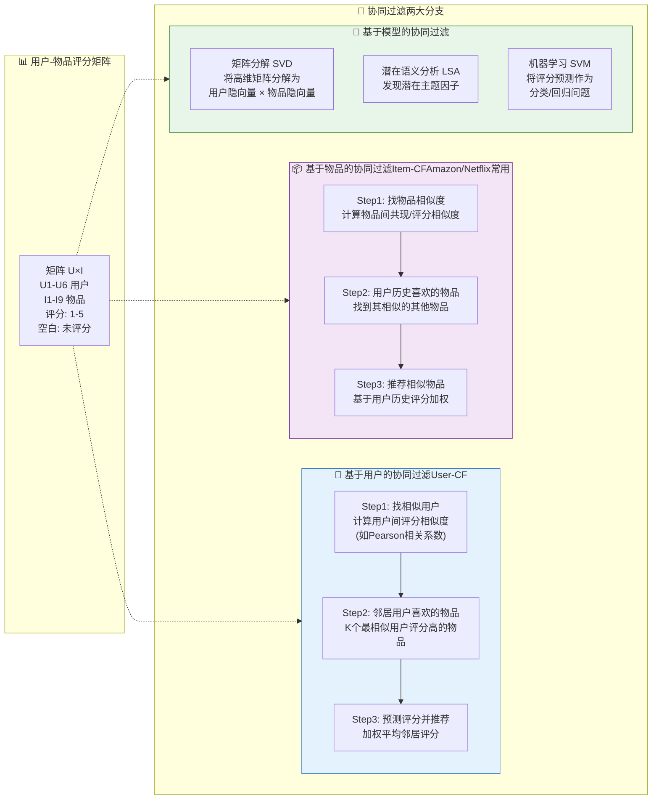

### 协同过滤的独特之处

|              | **基于内容 CB**                                   | **协同过滤 CF**                                        |
| ------------ | ------------------------------------------------- | ------------------------------------------------------ |
| **思维方式** | 看"物品本身长什么样"                              | 看"谁跟你臭味相投"                                     |
| **依赖什么** | 需要物品的详细标签<br/>（电影的类型、演员、简介） | 只需要用户的打分/点击行为<br/>（不需要知道物品是什么） |

#### 优点

1. **不怕"标签缺失"**

- **CB 的困境**：如果一部电影没写类型、没打标签，CB 就瞎了，不知道怎么推荐
- **CF 的智慧**：哪怕这部电影什么信息都没有，只要发现"跟你很像的小王"给了五星，就直接推给你
- **💡 人话**：CF 像问朋友"这好不好看"，不需要自己研究这东西是啥

2. **相信"群众眼睛是雪亮的"**

- **CB 的坑**：内容相似 ≠ 质量好。两本书都写"悬疑+推理"，可能一本是神作，一本是烂书
- **CF 的优势**：直接看真实用户的评分。如果 100 个跟你品味相近的人都给高分，那大概率真的好
- **💡 人话**：CB 看"包装"，CF 看"口碑"

3. **能发现"意外之喜"（打破信息茧房）**

- **CB 的局限**：你喜欢科幻，CB 只推科幻，你永远看不到其他类型的好东西
- **CF 的魔法**：发现"爱科幻的你"和"爱科幻的小李"品味相似，小李最近迷上了一部纪录片，CF 就敢推给你这部纪录片（虽然内容完全不同，但可能存在某种内在联系，比如都是烧脑型）
- **💡 人话**：CB 是"因为你喜欢苹果，所以推梨（都是水果）"；CF 是"因为你和小王都喜欢苹果，小王最近爱上了牛排，所以推你牛排"

> **CB 是"看脸"推荐**——只看物品特征，长得像就推  
> **CF 是"社交"推荐**——看用户关系，臭味相投就推

### 协同过滤的弱点

#### 1. 稀疏矩阵

想象一个 **100 万用户 × 10 万物品** 的电影网站：

- 总格子数：1000 亿个（评分位）
- 实际有评分的：可能只有**0.01%**（1 亿个）
- **99.99%的格子是空的**（白色区域）

这就是**稀疏矩阵**——像个巨大的筛子，到处都是洞。

为什么会这样？

```
用户A：看过100部电影（只占总库的0.1%）
用户B：看过50部电影
物品X：被1000人评分（只占用户总数的0.1%）
```

**现实规律**：每个用户只接触极小部分的物品，每个物品也只被极少数用户评价。

#### 2. 太依赖历史数据：算法的"记忆力缺陷"

| 场景         | 算法表现 | 通俗解释                                          |
| ------------ | -------- | ------------------------------------------------- |
| **老用户**   | 推荐很准 | 看了 1000 部电影， tastes 被摸透了                |
| **轻度用户** | 推荐很迷 | 只看 3 部，算法猜不透你是真喜欢科幻，还是偶然点错 |
| **空格子**   | 无法预测 | 用户没看过的电影，算法两眼一抹黑                  |

核心矛盾

```
算法想算：用户A对物品X的喜好度
需要：用户A的历史行为 + 其他用户对物品X的评分
现实：两边都是空白，算个寂寞
```

#### 3. 冷启动问题

稀疏矩阵直接导致了**冷启动**（Cold Start）——就像新员工入职第一天的茫然。

- **用户冷启动**（最常见）

  - **症状**：新用户注册，啥历史都没有，系统懵了
  - **算法内心**："我根本不知道你喜欢啥，怎么推？"
  - **现实类比**：刚加微信的朋友，你都不知道 TA 喜欢猫还是狗

- **物品冷启动**

  - **症状**：新电影刚上架，没人评分，系统不敢推
  - **算法内心**："这电影啥口碑？我不敢随便推荐啊"
  - **现实类比**：新餐厅开业，没有大众点评，没人敢去

- **系统冷启动**（创业初期）
  - **症状**：平台刚上线，用户少+物品少，双 sparse
  - **算法内心**："巧妇难为无米之炊"

#### 4. 混合推荐

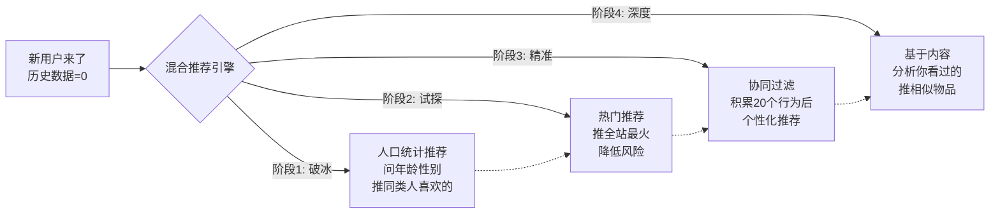

- 实际案例：抖音/快手

| 阶段          | 策略                 | 目的                      |
| ------------- | -------------------- | ------------------------- |
| **0-1 小时**  | 推**热门**+**同城**  | 先让你有内容看，别走      |
| **1-24 小时** | 推**相似用户**喜欢的 | 测试你的反应（点赞/划走） |
| **24 小时后** | **协同过滤**全开     | 千人千面，精准投喂        |

| 单一算法的问题             | 混合后的解法                         |
| -------------------------- | ------------------------------------ |
| 协同过滤怕新用户（没数据） | 先用**人口统计**或**热门**顶上       |
| 内容推荐怕新物品（没标签） | 先用**协同过滤**推给相似用户积累数据 |
| 两者都怕数据稀疏           | **基于模型**（矩阵分解）填补空白格子 |

### 用户协同

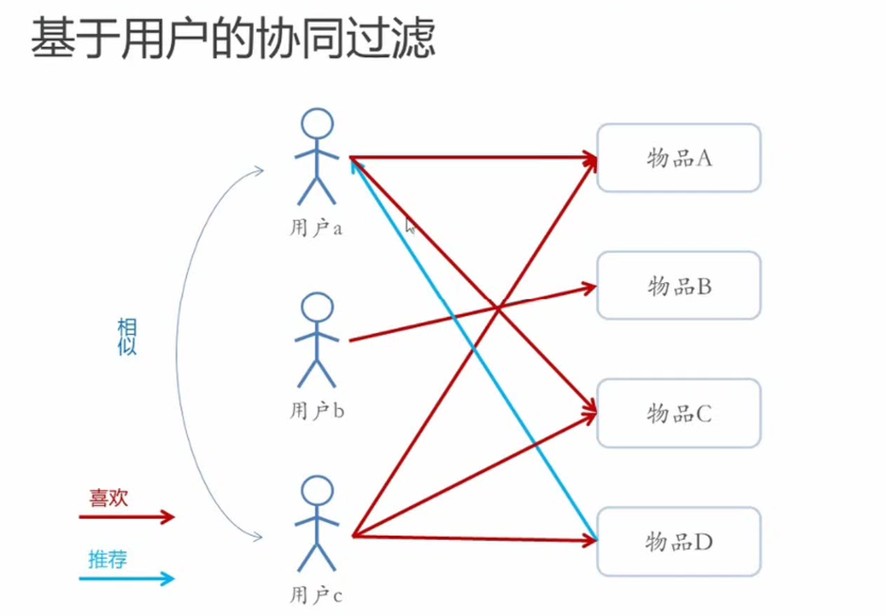

|         维度         |          **人口统计学**<br/>_"人以类聚"_           |       **User-CF（基于用户的协同过滤）**<br/>_"人以群分"_        |
| :------------------: | :------------------------------------------------: | :-------------------------------------------------------------: |
|      **看的是**      |    你的**户口本信息**<br/>（年龄、性别、地域）     |       你的**行为档案**<br/>（看过什么、打几分、停留多久）       |
|   **找相似的方式**   |      标签完全匹配<br/>"25 岁女性找 25 岁女性"      |    行为模式相似<br/>"你爱科幻+悬疑，她爱科幻+悬疑 → 你们像"     |
| **需不需要历史数据** |         **不需要**<br/>注册时填个表就能推          |         **极度依赖**<br/>至少要有 10-20 个行为才能算像          |
|     **会不会变**     | **静态**<br/>你今年 25 明年 26，但算法可能还没更新 |         **动态**<br/>你昨天爱甜剧今天爱悬疑，推荐立马变         |
|      **侵犯感**      |  **强**<br/>"它怎么知道我 25 岁？"（你告诉它的）   | **隐蔽但细思极恐**<br/>"它怎么知道我爱看这个？"（你自己暴露的） |

### 物品协同

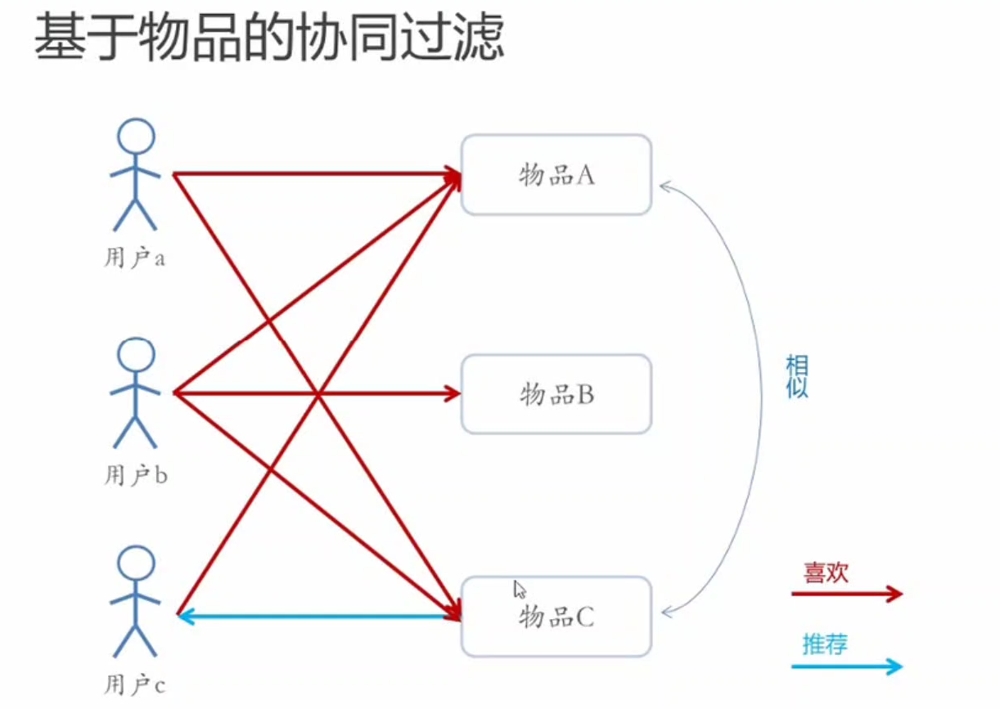

> 从**用户视角**看（红色的"喜欢"线），User-CF 和 Item-CF 长得几乎一样，都是人连物品；  
> 但从**物品视角**看，**Item-CF 看的是"哪几个物品被同一群人爱"**（共现关系），而不是"哪几个人像"。

**"因为喜欢 A 的人，也都喜欢 C，所以 A 和 C 是兄弟，互相推荐"**

1. 图中细节

   ```
   用户a 喜欢 物品A、物品C
   用户b 喜欢 物品A、物品B、物品C
   用户c 喜欢 物品A、物品C

   → 物品A 和 物品C 被同一群人（a、b、c）喜欢了
   → 系统判定：A和C是"相似物品"（右侧弧线）
   → 如果用户c喜欢A，就推荐C给他（蓝色线）
   ```

2. **关键区别**：

   - **User-CF**：算"用户 a 和用户 c 像不像"（纵向比较人）
   - **Item-CF**：算"物品 A 和物品 C 像不像"（横向比较物）

3. 为什么电商（Amazon）更爱 Item-CF？

| 对比维度         | User-CF（纵向找人）                            | Item-CF（横向找物）                                    |
| :--------------- | :--------------------------------------------- | :----------------------------------------------------- |
| **相似度稳定性** | 用户兴趣变得快，相似用户今天像明天可能就不像了 | 物品相似度很稳定（《哈利波特》和《指环王》永远是兄弟） |
| **计算时机**     | 每次推荐都要实时算"谁和当前用户像"（慢）       | 可以**离线预计算**物品相似度表（快）                   |
| **解释性**       | "和你相似的用户喜欢"（有点虚）                 | "购买了该商品的用户也购买了"（Amazon 经典文案，很实）  |
| **数据稀疏影响** | 用户行为多变，很难找到稳定相似的邻居           | 物品被多人评价，更容易找到稳定的共现模式               |

### 混合

1. 加权混合 = **调鸡尾酒**
   **原理**：几种算法的推荐结果**打分混合**，按比例加权算总分  
   **例子**：

- 协同过滤说"推荐度 80 分"
- 内容推荐说"推荐度 60 分"
- 加权公式：`总分 = 0.7×80 + 0.3×60 = 74分`

2. 切换混合 = **自动挡换档**
   **原理**：**看情况选算法**，不同场景用不同策略  
   **例子**：

```
if 新用户（历史数据<5条）:
    用"热门推荐"（解决冷启动）
else if 系统负载高（服务器压力大）:
    用"轻量级算法"（快速响应）
else:
    用"精准协同过滤"（追求质量）
```

3. 分区混合 = **分盘装菜**
   **原理**：**不同算法的结果分区块展示**，互不干扰  
   **例子**（淘宝首页布局）：

```
┌─────────────────────────┐
│  [猜你喜欢]  ← 协同过滤  │
│  物品A 物品B 物品C       │
├─────────────────────────┤
│  [新品上市]  ← 内容推荐  │
│  物品X 物品Y 物品Z       │
├─────────────────────────┤
│  [大家都在买] ← 热门推荐 │
│  物品P 物品Q 物品R       │
└─────────────────────────┘
```

4. 分层混合 = **流水线筛选**
   **原理**：**串联接力**，前一个算法的输出当后一个的输入  
   **例子**（推荐系统的"召回 → 排序"流程）：

```
第1层（粗筛）：协同过滤从10万物品中选出1000个候选
        ↓
第2层（精排）：深度学习模型从这1000个中选出Top 50
        ↓
第3层（微调）：业务规则（过滤已购买、去重）输出最终10个
```

## 评测

### 一、整体认知：为什么需要三种实验？

想象你要推出一款新饮料：

- **离线实验** = 在实验室里做成分分析、口味测试（不用真人喝）
- **用户调查** = 找 100 个人来试喝，填问卷问他们喜不喜欢
- **在线实验（AB 测试）** = 真正把饮料摆上货架，看路人会不会买

这三种方法构成一个**漏斗**：先用离线实验快速筛选大量算法 → 用用户调查验证主观体验 → 最后 AB 测试验证商业价值。一个新算法要全部通过才能正式上线。

### 二、离线实验（Offline Experiment）

#### 流程

1. **捞数据**：从日志系统提取用户历史行为（点击、购买、评分等）
2. **切数据**：按时间或随机分成训练集/测试集（常见的是 8:2 或 7:3）
3. **训模型**：在训练集上训练推荐模型
4. **测效果**：在测试集上预测，用离线指标（如 RMSE、Precision@K、Recall@K）评估

#### 优点

| 优势       | 说明                                             |
| ---------- | ------------------------------------------------ |
| **零风险** | 不需要真实用户参与，算法再烂也不会影响线上业务   |
| **超快速** | 几小时能测试几十种算法组合，适合暴力搜索最优参数 |
| **零成本** | 不需要系统控制权，只要有历史数据就能做           |
| **可复现** | 同样的数据集跑两次，结果完全一样                 |

#### 缺点

| 局限                    | 说明                                                                                   |
| ----------------------- | -------------------------------------------------------------------------------------- |
| **离线指标 ≠ 商业指标** | 预测准确率（RMSE）高不代表点击率高，更不代表赚钱。这就像考试满分的学生不一定工作能力强 |
| **无法测主观感受**      | 测不出"多样性""新颖性""惊喜度"这些用户主观体验                                         |
| **数据偏差**            | 历史数据只包含用户看过/买过的物品，对没见过的物品一无所知（这叫"选择偏差"）            |
| **冷启动盲区**          | 离线实验测不了新用户/新物品的推荐效果                                                  |

#### 实际案例

Netflix 大赛就是典型的离线实验：给参赛者一个数据集，看谁能最准确地预测用户评分。但冠军算法（SVD++）在实际部署时效果并没有预期那么好，因为离线优化的只是评分预测误差。

### 三、用户调查（User Study）

#### 运作流程

招募一批真实用户（通常几十到几百人），让他们在测试环境里使用推荐系统：

1. 观察行为（点击路径、停留时长）
2. 填写问卷（满意度、多样性、新颖性评分）
3. 访谈追问（为什么喜欢/不喜欢）
4. 统计分析

#### 优点

| 优势             | 说明                                                                                               |
| ---------------- | -------------------------------------------------------------------------------------------------- |
| **捕捉主观体验** | 唯一能获取"满意度""惊喜度""信任度"的方法。比如用户可能觉得推荐很"贴心"，这在离线指标里完全体现不了 |
| **低风险**       | 就算推荐烂到家，也只在封闭测试环境，不会流失真实客户                                               |
| **可追问原因**   | 发现用户点了"不推荐"按钮时，可以问"具体哪里不满意"                                                 |

#### 缺点

| 局限         | 说明                                                                                     |
| ------------ | ---------------------------------------------------------------------------------------- |
| **样本量小** | 招 500 人已经很难了，但线上可能有 500 万用户，统计意义不足                               |
| **霍桑效应** | 用户在被观察时行为会不自然（就像你意识到有摄像头时会整理仪容），测试结果和真实行为有偏差 |
| **双盲困境** | 很难做到既不让用户知道在测算法 A 还是 B，也不让实验员知道（否则实验员会引导用户）        |
| **成本高**   | 招募、补贴、场地、分析，一次实验可能耗资数万                                             |

#### 关键技巧

- **交叉验证**：同一批用户要测算法 A 也要测算法 B，避免人群差异
- **多维度评分**：不要只问"满不满意"，要问"准不准""新不新""多不多样"
- **行为+问卷结合**：用户嘴上说"喜欢多样性"，但行为上只点热门内容（言行不一很常见）

### 四、在线实验/AB 测试（Online Experiment）

#### 运作流程

1. **分流**：把线上用户随机分成两组（比如按用户 ID 哈希值奇偶分）
   - A 组（对照组）：用老算法
   - B 组（实验组）：用新算法
2. **上线**：两组用户同时在线使用，互不感知
3. **采集**：实时统计点击率（CTR）、转化率（CVR）、停留时长、GMV 等商业指标
4. **对比**：用统计检验（如 t 检验）看 B 组是否显著优于 A 组

#### 优点

| 优势               | 说明                                                       |
| ------------------ | ---------------------------------------------------------- |
| **真金白银的指标** | 直接测点击率、转化率、收入、留存率，这些是 CEO 真正关心的  |
| **真实环境**       | 用户在自然状态下使用，没有"被观察"的扭曲                   |
| **因果明确**       | 随机分流保证了两组用户特征相同，指标差异只能归因于算法差异 |

#### 缺点

| 局限             | 说明                                                                          |
| ---------------- | ----------------------------------------------------------------------------- |
| **周期超长**     | 要测出统计学显著的差异，往往需要跑 1-4 周。万一效果不好，这段时间就在亏钱     |
| **流量昂贵**     | 大型网站 AB 测试平台本身是个复杂工程，需要专门的分流系统和实时监控            |
| **风险敞口**     | 如果新算法有 bug 或体验极差，会直接影响真实用户（比如推荐色情内容、重复推荐） |
| **难以全量测试** | 不可能把 100 个候选算法都上线测，只能测离线+用户调查筛选后的"决赛选手"        |

### 五、三者的配合流程

一个新算法上线前必须经历的标准路径：

```
算法构思 → 离线实验（快速淘汰90%的平庸算法）
    ↓ 胜出者
用户调查（验证主观体验不崩）
    ↓ 通过者
小规模AB测试（1%流量，验证无重大bug）
    ↓ 指标提升
大规模AB测试（50%流量，验证商业指标）
    ↓ 显著胜出
全量上线
```

### 六、评测指标对照表

| 维度           | 离线实验               | 用户调查               | AB 测试               |
| -------------- | ---------------------- | ---------------------- | --------------------- |
| **预测准确率** | RMSE、MAE、Precision@K | -                      | -                     |
| **排序质量**   | nDCG、MAP、MRR         | -                      | -                     |
| **覆盖率**     | 覆盖率、多样性、新颖度 | 新鲜感评分             | 长尾物品点击占比      |
| **主观体验**   | -                      | 满意度、惊喜度、信任度 | 满意度问卷弹窗        |
| **商业指标**   | -                      | -                      | CTR、CVR、GMV、留存率 |
| **系统性能**   | 训练时间、内存占用     | 响应延迟感受           | 服务器负载、P99 延迟  |

### 七、推荐准确度评测的两个核心范式

#### 1. 本质区别

想象你要给朋友推荐餐厅：

| 场景                                              | 范式           | 核心问题               |
| ------------------------------------------------- | -------------- | ---------------------- |
| 朋友问："这家餐厅我打几分？" → 你预测**具体分数** | **评分预测**   | 猜得准不准？           |
| 朋友问："给我推荐 5 家餐厅" → 你给出**一个列表**  | **Top-N 推荐** | 列表里有没有他喜欢的？ |

**关键差异**：评分预测关注**数值精度**，Top-N 关注**排序质量**。实际工业界 99%的场景是 Top-N，因为用户很少打分，但经常刷推荐流。

#### 2.评分预测（Rating Prediction）

##### RMSE（均方根误差）

$$RMSE = \sqrt{\frac{\sum_{(u,i)\in T}(r_{ui} - \hat{r}_{ui})^2}{|T|}}$$

**通俗解释**：先算误差平方的平均，再开根号。对大误差（比如预测 1 分实际 5 分）惩罚很重。

**生活类比**：就像老师算成绩，

- 误差 1 分 → 平方是 1
- 误差 5 分 → 平方是 25（惩罚翻了 25 倍！）

**特点**：对大偏差极度敏感，适合**不能容忍极端错误**的场景（如金融风险评估）。

##### MAE（平均绝对误差）

$$MAE = \frac{\sum_{(u,i)\in T}|r_{ui} - \hat{r}_{ui}|}{|T|}$$

**通俗解释**：误差的绝对值平均，一视同仁，不放大错误。

**生活类比**：就像算平均差距，预测差 1 分和差 5 分就是简单的 1:5 关系，没有平方惩罚。

**特点**：更稳健， outliers（异常值）影响小，适合**整体水平评估**。

##### 优点

- **数学性质好**：处处可导，方便用梯度下降优化
- **物理意义清**：RMSE 单位就是评分单位（如 1-5 分制），MAE 直接是平均差几分
- **可解释强**：MAE=0.5 意味着预测平均差半颗星

##### 缺点

| 局限             | 详细说明                                                                           |
| ---------------- | ---------------------------------------------------------------------------------- |
| **脱离业务目标** | 预测评分准 ≠ 用户会点击。用户给 5 分的电影他不一定会看，给 3 分的短视频可能点着玩  |
| **稀疏性问题**   | 用户打分数据极少（<1%），大量物品没评分，测不准                                    |
| **忽略排序**     | 预测[5,4,3]和[4,5,3]的 RMSE 一样，但推荐列表顺序完全不同                           |
| **评分偏差**     | 用户 A 是"好评师"（全给 4-5 分），用户 B 是"差评师"（全给 1-2 分），模型难以自适应 |

##### 适用场景

- **显式评分系统**：豆瓣电影、Amazon 商品评分、网易云音乐
- **算法研究**：学术界基准测试（Netflix Prize 就用 RMSE）

#### 3. Top-N 推荐（真正工业界的主力）

假设推荐列表有 N 个物品，用户实际喜欢的集合叫$R_{test}$，推荐列表叫$R_{rec}$。

##### Precision（精确率）

$$Precision = \frac{|R_{rec} \cap R_{test}|}{|R_{rec}|}$$

**通俗解释**：推荐 10 个，用户点了 3 个，Precision=30%。**衡量"推的准不准"**。

**生活类比**：就像射箭，

- 射 10 箭，中 3 箭 → Precision=30%
- 只关心射出去的有没有中，不关心漏了多少目标

##### Recall（召回率）

$$Recall = \frac{|R_{rec} \cap R_{test}|}{|R_{test}|}$$

**通俗解释**：用户实际喜欢 100 个物品，你推荐了其中 30 个，Recall=30%。**衡量"找得全不全"**。

**生活类比**：就像捕鱼，

- 池塘里有 100 条鱼，网住了 30 条 → Recall=30%
- 不关心网里有没有垃圾，只关心鱼有没有漏网

##### 优点

| 优势             | 说明                                                                   |
| ---------------- | ---------------------------------------------------------------------- |
| **贴近业务**     | 直接对应"曝光 → 点击"的转化逻辑，和 CTR 强相关                         |
| **处理隐式反馈** | 不需要用户显式打分，只要有"点击/购买/收藏"行为就能测                   |
| **允许部分命中** | 用户可能喜欢 100 个物品，你推 10 个中 3 个也算有效（Precision@10=30%） |

##### 缺点

| 局限                      | 说明                                                                                                  |
| ------------------------- | ----------------------------------------------------------------------------------------------------- |
| **Precision-Recall 矛盾** | 想提高 Precision（推的更准），就要少推不确定的，Recall 必然下降；反之亦然。**必须牺牲一个成全另一个** |
| **位置偏见**              | 列表第 1 位和第 10 位点击率天然差 5-10 倍，但 Precision 把它们视为等同                                |
| **忽略未曝光物品**        | 测试集只包含用户看过的物品，你不知道用户会不会喜欢没看过的（存在偏差）                                |
| **N 的选择困难**          | Precision@1、@5、@10、@50...选哪个？不同 N 结果可能相反                                               |
| **二元化损失信息**        | 把"喜欢/不喜欢"变成 0/1，丢失了"非常喜欢 vs 一般喜欢"的梯度                                           |

#### 4. 为什么 RMSE 好 ≠ 业务好？

这是推荐系统最大的认知陷阱！举个例子：

**场景**：给用户推荐电影

- **算法 A**：预测《肖申克》5.0 分（实际 5 分），《逐梦演艺圈》1.0 分（实际 1 分），RMSE=0
- **算法 B**：预测《肖申克》4.5 分，《逐梦演艺圈》3.0 分，RMSE 更高

**但是**：算法 A 只推 5 分电影（都是经典老片，用户早看过了），算法 B 推了 3 分的冷门新片，用户可能点开发现惊喜。

**结果**：算法 A 的 RMSE=0（完美），但 CTR=0（用户不点）；算法 B 的 RMSE 高，但 CTR 高。

**本质原因**：

1. **预测 5 分没用**：用户早看过了，你再推他也不点
2. **预测 3 分有价值**：用户没看过，点击探索
3. **RMSE 惩罚"预测 4 实际 5"和"预测 5 实际 4"**，但业务上前者是"少推了喜欢的"，后者是"多推了没看的"

### 八、机器学习中最基础也最容易混淆的三个评估指标

假如某个班级有男生 80 人,女生 20 人,共计 100 人，目标是找出所有女生。现在某人挑选出 50 个人，其中 20 人是女生，另外还错误的把 30 个男生也当作女生挑选出来了。那么怎样评估他的工作?

#### 1. 混淆矩阵：先搭好骨架

在算指标前，必须先理解这四个格子（建议记死）：

| 真实情况\预测结果          | 预测为正类（认为是女生）                 | 预测为负类（认为不是女生）              |
| -------------------------- | ---------------------------------------- | --------------------------------------- |
| **实际为正类（真是女生）** | **TP** (True Positive)<br>真阳性：20 人  | **FN** (False Negative)<br>假阴性：0 人 |
| **实际为负类（真是男生）** | **FP** (False Positive)<br>假阳性：30 人 | **TN** (True Negative)<br>真阴性：50 人 |

**记忆口诀**：

- 第一个字母：**T**=猜对了，**F**=猜错了
- 第二个字母：**P**=猜你是正类，**N**=猜你是负类

**按图片例子填数**：

- 总共 100 人：20 女（正类），80 男（负类）
- 选出 50 人：20 女（TP），30 男（FP）
- 未选出 50 人：0 女（FN），50 男（TN）

#### 2. 三个指标的计算与灵魂

##### 1. 准确率（Accuracy）

**公式**：$$Accuracy = \frac{TP + TN}{Total} = \frac{20 + 50}{100} = 70\%$$

**人话翻译**：**瞎猜猜对的概率**。100 个人里，我不管男女，只要猜对了 70 个，准确率就是 70%。

**✅ 优点**：

- **最直观**：小学数学水平就能懂，" overall correctness "
- **好比较**：不同模型直接比数字大小，70% > 60% 就是更好

**❌ 缺点**：

- **被类别不平衡绑架**：如果班级是 1 个女生+99 个男生，我直接说"全是男生"，准确率 99%，但完全没找出女生！这在推荐系统里叫"** popularity bias**"（只推热门，长尾全灭）
- **对业务目标不敏感**：70%准确率可能全是把男生猜对，女生一个没找对，但数字看起来还不错

**适用场景**：类别平衡（男女各 50%）且**代价对称**（猜错男和猜错女一样严重）。医疗诊断、欺诈检测等**千万别单看 Accuracy**！

#### 2. 精确率（Precision）- **"查准率"**

**公式**：$$Precision = \frac{TP}{TP + FP} = \frac{20}{20 + 30} = 40\%$$

**人话翻译**：**你选出的人里，有多少比例是真的女生？** 你挑了 50 个说是女生，结果只有 20 个是，另外 30 个是男生混进来的，所以"纯度"只有 40%。

**✅ 优点**：

- **衡量"宁缺毋滥"**：Precision 高意味着你很有把握才出手，宁可漏掉也不乱抓
- **适合高成本误报场景**：
  - 垃圾邮件过滤：把好邮件判为垃圾（FP）代价极高（用户收不到重要邮件），必须保证 Precision
  - 司法判案：冤枉好人（FP）比放过坏人更不可接受
  - 电商推荐：首页坑位极贵，推一个不相关的（FP）就是浪费流量，必须保证 Precision@K

**❌ 缺点**：

- **不管漏网之鱼**：Precision=100%很简单——我只挑 1 个最有把握的，是女生，Precision=100%，但另外 19 个女生我全不管了！这就是**高 Precision 低 Recall**的陷阱
- **无法衡量完整性**：适合"精品推荐"，不适合"全面发现"

##### 3. 召回率（Recall）- **"查全率"**

**公式**：$$Recall = \frac{TP}{TP + FN} = \frac{20}{20 + 0} = 100\%$$

**人话翻译**：**所有真实女生中，有多少被你找出来了？** 总共 20 个女生，你找出 20 个，一个没漏，Recall=100%。

**✅ 优点**：

- **衡量"宁可错杀，不可放过"**：Recall 高意味着你覆盖面广，宁愿抓错也不漏抓
- **适合高成本漏检场景**：
  - 癌症筛查：漏掉一个病人（FN）可能就是一条命，必须 Recall 高（宁可把健康人拉来复查）
  - 欺诈检测：漏掉一笔欺诈交易（FN）损失巨大，宁可多审核正常交易

**❌ 缺点**：

- **不管精确度**：Recall=100%也很简单——我把全班 100 人都说是女生，肯定不漏掉任何真女生，但 FP=80，Precision 只有 20%，全是误报！
- **用户体验差**：推荐系统 Recall 太高会给用户一堆"勉强相关"的内容，像在垃圾堆里翻宝贝

#### 3. Precision vs Recall：鱼与熊掌不可兼得

这是最关键的**权衡（Trade-off）**：

##### 形象比喻：用网捕鱼

- **Precision 高** = 网眼小，只捞大鱼（确定是女生），小鱼漏掉（可能是女生但不确定）→ 捞上来的都是精品，但漏了很多
- **Recall 高** = 网眼大，大小通吃 → 鱼都捞上来了，但垃圾也捞上来很多

##### 数学关系

当你调整推荐算法的**阈值**（比如"相似度>0.8 才推荐"）：

- **提高阈值**（更严格）：Precision ↑，Recall ↓
- **降低阈值**（更宽松）：Precision ↓，Recall ↑

**在图片例子中**：

- 这个人 Recall=100%（没漏女生），但 Precision 只有 40%（混进来 30 个男生）
- 如果他提高标准，只选最有把握的 15 个（全是女生）：Precision=100%，但 Recall=15/20=75%（漏了 5 个女生）

##### F1-Score：和事佬

当 Precision 和 Recall 打架时，用 F1 调和：
$$F1 = 2 \times \frac{Precision \times Recall}{Precision + Recall}$$

在这个例子中：
$$F1 = 2 \times \frac{0.4 \times 1.0}{0.4 + 1.0} = 2 \times \frac{0.4}{1.4} \approx 0.57$$

F1 越高，说明两者平衡得越好。

#### 4. 在推荐系统中的血泪教训

##### 1. 为什么推荐系统几乎不用 Accuracy？

想象一个场景：商品库有 10000 件商品，用户只买过 10 件。

- 如果算法预测"用户不喜欢其余 9990 件"（TN=9990），Accuracy=99.9%！
- 但这毫无意义，因为我们要找的是那 10 件（TP），不是去确认那 9990 件用户确实不喜欢。

**结论**：推荐系统是**极度不平衡的分类问题**（正样本极少），Accuracy 会虚假繁荣。

##### 2. Precision@K 和 Recall@K 的跷跷板

在 Top-N 推荐中：

- **K 越大**（推荐列表越长）：Recall 必然升高（给得多总能多命中几个），Precision 必然降低（位置越往后质量越差）
- **K 越小**（如 K=1）：Precision 要求高（首位必须准），Recall 必然极低（只能覆盖用户一小部分兴趣）

**业务选择**：

- **首页首屏**（K=5-10）：死磕 Precision，因为用户目光只停留前 3 秒
- **"猜你喜欢"瀑布流**（K=100+）：关注 Recall，希望覆盖用户多元兴趣

##### 3. 类别不平衡时的指标选择

- **新闻/短视频推荐**（头部效应严重，99%点击集中在 1%内容）：
  - 只看 Precision：算法会只推热门，陷入"信息茧房"
  - 必须结合**Coverage（覆盖率）** 和 **Novelty（新颖性）**，防止成为"复读机"

##### 4. 真实案例：为什么好算法离线指标高，线上被骂？

- **离线实验**：优化 Precision@10，算法学会了只推"最安全"的热门内容
- **线上 AB 测试**：用户新鲜感下降，CTR 反而降低
- **教训**：离线优化 Precision 时，要同时监控**多样性（Diversity）** 指标，否则用户会审美疲劳

> 抓逃犯时，Recall 更重要（不能让逃犯跑了）；  
> 发奖状时，Precision 更重要（不能错发给坏人）；  
> 看总体表现时，Accuracy 是烟雾弹（班级里 99 个男生，你全猜男也有 99 分，但没意义）。

## K 近邻算法（KNN）详解

### 一、核心思想：物以类聚

**一句话理解**：**近朱者赤，近墨者黑。通过观察一个样本周围最近的 K 个"邻居"是什么类别，来决定这个样本属于什么类别**。

> 注意：KNN 中的"邻居"指的是**在特征空间中距离近**，而不是地理位置上的邻居。

### 二、关键概念拆解

#### 1. **K 是什么？**

- K 是**邻居的数量**（通常取 1-20 之间的整数）
- **K=3**：看距离最近的 3 个邻居，哪个类别多就归哪类
- **K=5**：看距离最近的 5 个邻居，哪个类别多就归哪类

**K 的选择直接决定分类结果**！

#### 2. **特征空间（Feature Space）**

每个样本都有多个特征（比如一个电影：类型、时长、评分、导演...），这些特征构成了一个多维空间。每个样本就是空间中的一个点。

**距离越近 = 特征越相似**

### 三、距离怎么算？（算法的数学基础）

KNN 需要计算样本间的"距离"来判断相似度。常用的有两种：

#### 1. **欧氏距离（Euclidean Distance）**

**直观理解**：两点之间的直线距离（像鸟飞过去）

$$d(x,y) = \sqrt{\sum_{k=1}^{n}(x_k - y_k)^2}$$

**生活类比**：从家到学校直线穿小区的距离。

#### 2. **曼哈顿距离（Manhattan Distance）**

**直观理解**：网格路径距离，只能横平竖直走（像城市街区）

$$d(x,y) = \sum_{k=1}^{n}|x_k - y_k|$$

**生活类比**：在纽约曼哈顿街区走路，必须沿着街道网格走，不能斜穿建筑物。

**选用建议**：

- 数据连续、分布均匀 → **欧氏距离**
- 高维数据、网格型数据（如文本）→ **曼哈顿距离**或其他

### 四、算法执行流程（5 步走）

按照你图中的步骤，KNN 的完整流程是：

1. **算距离**：计算测试样本与训练集中**所有样本**的距离
2. **排个序**：按距离从小到大排序
3. **选邻居**：选出距离最小的**前 K 个**
4. **数票数**：统计这 K 个邻居中各类别出现的频率
5. **做决策**：哪个类别出现最多，测试样本就属于哪类

**特点**：**惰性学习（Lazy Learning）**

- 训练阶段：基本不做计算，只是存储数据（"死记硬背"）
- 预测阶段：临时计算距离并分类（"临阵磨枪"）

### 五、K 值选择的深层逻辑

#### K 太小（如 K=1）：

- **问题**：容易被噪声干扰（一个离群点就能影响结果）
- **现象**：**过拟合**——对训练数据太敏感，泛化能力差

#### K 太大（如 K=100）：

- **问题**：把远处的"不相关"样本也纳入考虑
- **现象**：**欠拟合**——过于平滑，忽略了局部特征

#### 怎么选 K？

- **交叉验证**：尝试不同 K 值，选准确率最高的
- **经验法则**：$K = \sqrt{n}$（n 为训练样本数），且通常选**奇数**（避免平票）

### 六、KNN 的优缺点

| 优点                       | 缺点                       |
| -------------------------- | -------------------------- |
| 思想简单，易于理解         | 预测速度慢（要算所有距离） |
| 无训练阶段，新数据易加入   | 存储开销大（要存全部数据） |
| 对异常值不敏感（取决于 K） | 特征尺度敏感（需归一化）   |
| 适合多分类问题             | 高维数据效果差（维度灾难） |

### 七、在推荐系统中的应用

KNN 是推荐系统的基石算法之一：

#### 1. **User-based CF（基于用户的协同过滤）**

- **思路**：找到与目标用户**兴趣相似**的 K 个邻居用户
- **推荐**：这 K 个邻居喜欢的物品，目标用户可能也喜欢

#### 2. **Item-based CF（基于物品的协同过滤）**

- **思路**：计算物品间的相似度（距离），找相似的 K 个物品
- **推荐**：用户买过 A，就推荐与 A 最相似的 K 个物品

**关键改进**：实际推荐中通常不用原始距离，而是用**余弦相似度**或**皮尔逊相关系数**来衡量用户/物品的相似性。

## 推荐总结

### 算法核心区别总览

推荐系统的算法看似繁杂，但核心差异在于**它凭什么觉得用户会喜欢**。以下是六大类算法的灵魂对比：

|       维度       | **人口统计学**<br>👥 _人以群分_ |        **基于内容**<br>📦 _物以类聚_        |        **协同过滤-用户**<br>🤝 _臭味相投_         |    **协同过滤-物品**<br>🔗 _人以群分_    |        **基于模型**<br>🧠 _潜在规律_         |   **热门统计**<br>🔥 _从众心理_    |
| :--------------: | :-----------------------------: | :-----------------------------------------: | :-----------------------------------------------: | :--------------------------------------: | :------------------------------------------: | :--------------------------------: |
|   **核心思想**   |     同龄同性别的人口味相似      |        你喜欢川菜，推相似的麻辣火锅         |    找与你历史行为最像的"饭友"，他们吃啥你吃啥     | 吃麻婆豆腐的人也爱吃水煮鱼，建立物品关联 | 用 SVD/神经网络学习用户-物品隐向量，预测评分 |    全站最火的单品，大家一致好评    |
|   **依赖数据**   | 用户注册信息（年龄/性别/地域）  |      物品元数据（食材/菜系/辣度/价格）      |        用户-物品行为矩阵（评分/点击/购买）        |         同上，但计算物品间相似度         |      同上+用户/物品特征，需大量数据训练      |   全局点击/购买计数，无需个性化    |
|  **冷启动处理**  | ⭐⭐⭐⭐⭐<br>新用户填表就能推  |    ⭐⭐⭐<br>需少量历史行为建立用户画像     |         ⭐<br>必须积累足够行为才能找邻居          |   ⭐⭐<br>新物品需被多人交互才有相似度   |           ⭐<br>需大量数据训练模型           | ⭐⭐⭐⭐⭐<br>无需用户数据，直接推 |
|   **可解释性**   |      强："25 岁女性都爱吃"      |       强："因为您喜欢川菜，推荐这款"        |             弱："和你相似的用户喜欢"              |        强："吃了这道菜的人还吃了"        |       极弱："模型预测您会喜欢"（黑盒）       |         中："本店销量第一"         |
|  **推荐多样性**  |      差：陷入统计刻板印象       |           差：信息茧房，只推同类            |       中：能发现跨品类惊喜（饭友口味多变）        |           中：局限于物品相似度           |           优：隐向量可捕捉深层关联           |       差：马太效应，只推头部       |
|  **计算复杂度**  |         极低：规则查询          |             低：向量相似度计算              |             极高：需实时算用户相似度              |       中：可离线预计算物品相似度表       |            高：训练复杂，但预测快            |           极低：排序计数           |
|    **实时性**    |              静态               |                   准实时                    |             难实时（用户相似度在变）              |                 可准实时                 |                 需重训练更新                 |         准实时（热榜更新）         |
| **美食场景示例** |    给"25 岁上海女性"推本帮菜    | 喜欢麻婆豆腐 → 推回锅肉（同为川菜/猪肉/辣） | 用户 A 和用户 B 都爱日料，B 爱吃新寿司店 → 推给 A | 点了汉堡的人常点可乐，推"汉堡+可乐套餐"  |    深度学习发现"深夜+高热量+辣味"的隐关联    |      "本周全网最火奶茶 Top10"      |

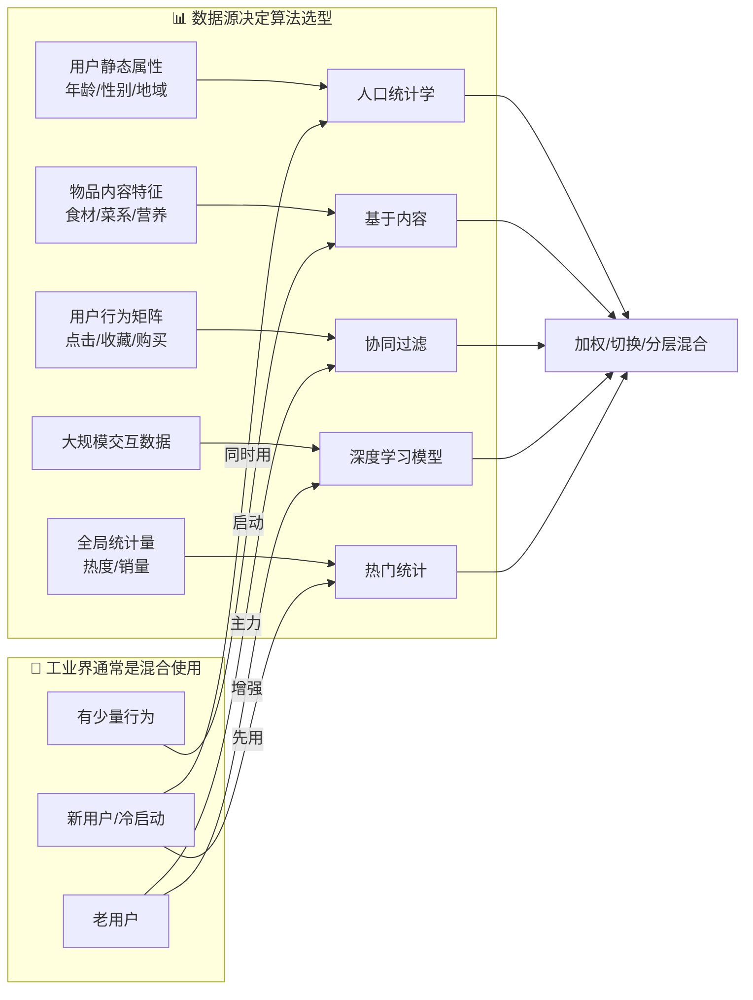

结合当前仓库的最终实现，更贴近工程现实的取舍是：

- 中文菜品链路先保证业务闭环，用热门统计和基于收藏的演示型协同过滤支撑页面展示。
- Yelp 链路优先做内容相似推荐，把大计算量放到离线构建命令里，在线只读取 JSON 候选。
- 个性化推荐不在线重算用户相似度，而是读取用户最近评分行为，再对离线相似候选做轻量重排。
- 评分版 UserCF 继续保留为离线实验能力，但不再作为主页面的核心依赖。

## 推荐详解

推荐系统的分类划分原则太多了：

- 实时/离线
- 是否个性化
  - 基于内容（需要物品标签、特征工程）
  - 相似性（行为数据，物品协同过滤、用户协同过滤）
  - 基于模型（发掘潜在规则）
  - 基于知识（人分类，推固定的）
- 基于统计与用户画像（最近热门，非个性化）

### 基于人口统计学（人的特征）

基于人口统计学的推荐机制(Demographic-based Recommendation)是一
种最易于实现的推荐方法，它只是简单的根据系统用户的基本信息发现用户
的相关程度，然后将相似用户喜爱的其他物品推荐给当前用户
对于没有明确含义的用户信息(比如登录时间、地域等上下文信息)，可以
通过聚类等手段，给用户打上分类标签
对于特定标签的用户，又可以根据预设的规则(知识)或者模型，推荐出对
应的物品
用户信息标签化的过程一般又称为用户画像(User Profiling)

用户画像
● 用户画像(UserProfile)就是企业通过收集与分析消费者社会属性、生活习
惯、消费行为等主要信息的数据之后，完美地抽象出一个用户的商业全貌作
是企业应用大数据技术的基本方式
用户画像为企业提供了足够的信息基础，能够帮助企业快速找到精准用户群
体以及用户需求等更为广泛的反馈信息
作为大数据的根基，它完美地抽象出一个用户的信息全貌，为进一步精准、
快速地分析用户行为习惯、消费习惯等重要信息，提供了足够的数据基础

### 基于内容（物品的特征）

基于内容的推荐算法
Content-based Recommendations(CB)根据推荐物品或内容的元数据，发
现物品的相关性，再基于用户过去的喜好记录，为用户推荐相似的物品。
通过抽取物品内在或者外在的特征值，实现相似度计算。 -比如一个电影，有导演、演员、用户标签 UGC、用户评论、时长、风格等等，都可以算是特
征。
将用户(user)个人信息的特征(基于喜好记录或是预设兴趣标签)，和物
品(item)的特征相匹配，就能得到用户对物品感兴趣的程度 -在一些电影、音乐、图书的社交网站有很成功的应用，有些网站还请专业的人员对物品进行基
因编码/打标签(PGC)

基于内容的推荐算法
.对于物品的特征提取一
打标签(tag)
专家标签(PGC) -用户自定义标签(UGC) -降维分析数据，提取隐语义标签(LFM)
.对于文本信息的特征提取 一
关键词
分词理和情感分析(NLP 叶
潜在语义分析(LSA)

### 基于内容推荐系统的高层次结构图

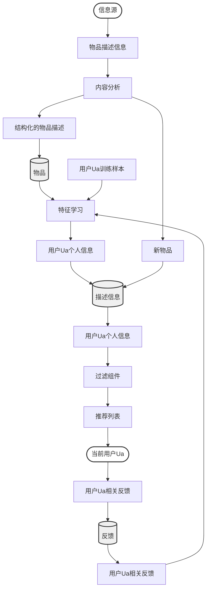

### 余弦相似度

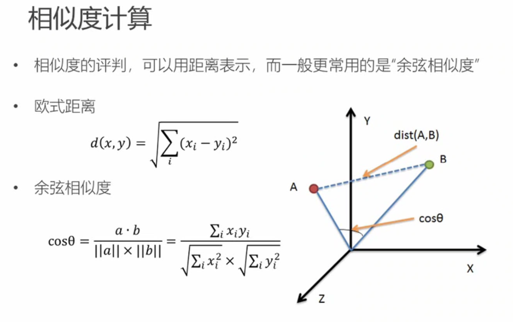

### 特征工程

特征工程
， 特征(feature):数据中抽取出来的对结果预测有用的信息。
，特征的个数就是数据的观测维度
特征工程是使用专业背景知识和技巧处理数据，使得特征能在机器学习算法上发挥更
好的作用的过程
特征工程一般包括特征清洗(采样、清洗异常样本)，特征处理和特征选择
特征按照不同的数据类型分类，有不同的特征处理方法 -数值型 -类别型 -时间型 -统计型

#### 数值型特征处理

数值型特征处理
用连续数值表示当前维度特征，通常会对数值型特征进行数学上的处理，主要的做法是
归一化和离散化

> 幅度调整/归一化
> 特征与特征之间应该是平等的，区别应该体现在特征内部
> 例如房屋价格和住房面积的幅度是不同的，房屋价格可能在 3000000~15000000(万)
> 之间，而住房面积在 40~300(平方米)之间，那么明明是平等的两个特征，输入到相
> 同的模型中后由于本身的幅值不同导致产生的效果不同，这是不合理的
> Featureold
> Featurenew -
> Featuremax
> -Featuremin

#### 归一化

#### 离散化

#### 类别特征处理

#### 时间型特征处理

#### 统计型特征处理

### 推荐系统常见反馈数据

推荐系统常见反馈数据
用户行为
类型
特征
作用
评分
显式
整数量化的偏好，可能的取值是[0,n];n 一般取值为 5 通过用户对物品的评分，可以精确地得到用户
或者是 10
偏好
投票
显式布尔量化的偏好，取值是 0 或 1
通过用户投票，可以较精确地得到用户偏好
通过用户转发行为,可以精确地得到用户偏好。
转发
显式布尔量化的偏好，取值是 0 或 1
如果是站内，同时可以推理得到被转发人的偏
好(不太精确)
保存/收藏
显示布尔是化的偏好，取值是 0 或 1
通过收藏行为,可以精确地得到户偏好。
打标签
通过分析用户打的标签,可以得到用户对项目
(Tag)
显示 一些单词,需要对单词进行分析,得到偏好
的理解，同时可以分析出用户的情感:喜欢还
是讨厌
评论
显示 一段文字，需要进行文本分析，得到偏好
通过分析用户的评论，可以得到用户的情感:
喜欢还是讨厌
点击浏览
隐式
组用户的点击，用户对物品感兴趣，需要进行分析，得 用户的点击一定程度上反映了用户的注意力,
(查看)
到偏好
所以它也可以从一定程度上反映用户的喜好。
页面停留时间
隐式 一组时间信息,噪音大，需要进行去噪，分析，得到偏好
用户的页面停留时间一定程度上反映了用户的
注意力和喜好，但噪音偏大，不好利用。
购买
隐式布尔量化的偏好，取值是 0 或 1
购买行为可以很明确地说明用户感兴趣。

### UGC 推荐算法

基于 UGC 的推荐
用户用标签来描述对物品的看法，所以用户生成标签(UGC)是联系用户和物品的纽
带，也是反应用户兴趣的重要数据源
一个用户标签行为的数据集一般由一个三元组(用户，物品，标签)的集合表示，其
中一条记录(u，i，b)表示用户 u 给物品 i 打上了标签 b
一个最简单的算法
统计每个用户最常用的标签
对于每个标签，统计被打过这个标签次数最多的物品 -对于一个用户，首先找到他常用的标签，然后找到具有这些标签的最热门的物品，推荐给他
，所以用户 u 对物品 i 的兴趣公式为
p(u,i) =
Z muonas
其中，nub 是用户 u 打过标签 b 的次数，np 是物品 i 被打过标签 b 的次数

#### UGC 简单推荐的问题

基于 UGC 简单推荐的问题
简单算法中直接将用户打出标签的次数和物品得到的标签次数相乘，可以简单地表现出用户对物品
某个特征的兴趣
这种方法倾向于给热门标签(谁都会给的标签，如"大片"、“搞笑"等)、热门物品(打标签人数最
多)比较大的权重，如果一个热门物品同时对应着热门标签，那它就会"霸榜”，推荐的个性化、新
颖度就会降低
类似的问题，出现在新闻内容的关键字提取中。比如以下新闻中，哪个关键字应该获得更高的权重?

### TF-IDF

TF-IDF
， 词频-逆文档频率(TermFrequency-Inverse DocumentFrequency，TF-IDF)是一种
用于资讯检索与文本挖掘的常用加权技术
TF-IDF 是一种统计方法，用以评估一个字词对于一个文件集或一个语料库中的其中一
份文件的重要程度。字词的重要性随着它在文件中出现的次数成正比增加，但同时会
随着它在语料库中出现的频率成反比下降
TFIDF =TF XIDF
TF-IDF 的主要思想是:如果某个词或短语在一篇文章中出现的频率 TF 高，并且在其他
文章中很少出现，则认为此词或者短语具有很好的类别区分能力，适合用来分类
TF-IDF 加权的各种形式常被搜索引擎应用，作为文件与用户查询之间相关程度的度量
或评级

#### 计算方式

TF-IDF
词频(Term Frequency，TF) -指的是某一个给定的词语在该文件中出现的频率。这个数字是对词数的归一化，以防止偏向更
长的文件。(同一个词语在长文件里可能会比短文件有更高的词数，而不管该词语重要与否。)
TFijnoj
ni.j
其中 TF，表示词语 i 在文档 j 中出现的频率，n 表示 i 在 j 中出现的次数，n 表示文档 j 的总词数
逆向文件频率(Inverse Document Frequency，IDF) -是一个词语普遍重要性的度量，某一特定词语的 IDF，可以由总文档数目除以包含该词语之文
档的数目，再将得到的商取对数得到
IDFi=log(N+1
N +1
其中 IDF 表示词语 i 在文档集中的逆文档频率，N 表示文档集中的文档总数，N 表示文档集中包含
了词语 i 的文档数

### TF-IDF 对 UGC 的优化（热门标签惩罚）

TF-IDF 对基于 UGC 推荐的改进
p(u,i) =
Zru ono
为了避免热门标签和热门物品获得更多的权重，我们需要对"热门"进行惩罚
● 借鉴 TF-IDF 的思想，以一个物品的所有标签作为"文档"，标签作为"词语"，从而计算
标签的"词频”(在物品所有标签中的频率)和"逆文档频率”(在其它物品标签中普遍出
现的频率)
由于"物品 i 的所有标签"n.应该对标签权重没有影响，而"所有标签总数"N 对于所有标
签是一定的，所以这两项可以略去。在简单算法的基础上，直接加入对热门标签和热
门物品的惩罚项:
p(u,i) =
Z og(14)log(1+)
nu,b
nb,i
其中，n“记录了标签 b 被多少个不同的用户使用过，n“记录了物品 i 被多少个不同的用户打过标签
