# 第四章 系统设计

## 4.1 系统总体功能设计

本系统是一个基于 Django 的餐饮个性化推荐平台，采用"双业务线 + 统一用户体系"的架构思路。在业务层面，系统同时承载中文菜品业务线与 Yelp 餐厅业务线：前者负责站内用户注册、菜品浏览、收藏评论和基础推荐等完整业务闭环；后者基于 Yelp 公开数据集，承载内容推荐、协同过滤实验与大数据离线处理等推荐系统核心能力的展示。两条业务线共享同一套用户认证与会话体系，但业务数据与推荐链路保持相对独立。

在工程层面，系统遵循"离线计算、在线轻量读取"的设计原则。重计算任务（如相似度构建、模型训练、词云生成、统计聚合）均通过 Django 管理命令在离线阶段完成，产物以 JSON 或图片形式持久化；在线页面仅执行数据库查询与轻量重排，从而保证响应速度与演示稳定性。Django 负责在线业务与页面渲染，Spark 负责 Yelp 大规模原始数据的离线统计与 ALS 矩阵分解训练，二者通过离线产物衔接。

系统的技术架构自上而下可分为四层：表现层（Django 模板 + 轻量前端增强）、业务逻辑层（View + Service）、数据持久层（Django ORM + MySQL）以及离线计算层（管理命令 + Spark 批处理）。图 4-1 展示了系统的总体功能框架。

### 图 4-1 系统总体功能框架图

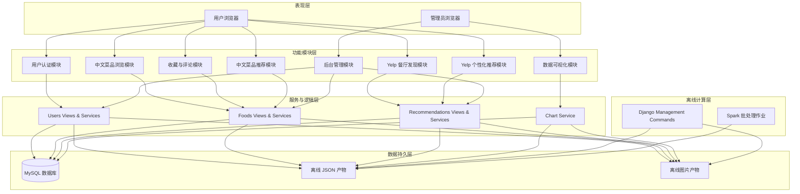

---

## 4.2 功能模块设计

本系统的功能模块按照用户角色划分为两大类：**普通用户**与**系统管理员**。普通用户主要使用面向消费者的功能，包括用户认证、中文菜品浏览、收藏评论、中文菜品推荐以及 Yelp 餐厅的发现与个性化推荐；系统管理员则通过后台管理页面对系统数据进行增删改查，并通过数据可视化模块观察系统运行态势与推荐特征。

以下先对各角色下的模块进行总体介绍，再基于实际代码逻辑逐一展开每个模块的功能，并绘制对应的代码流程图。

### 4.2.1 普通用户模块

#### （1）用户认证模块

用户认证模块负责处理用户的注册、登录、登出、个人信息修改及密码修改等功能。系统支持三类登录入口：本地账号登录、Yelp 演示账号登录以及管理员登录（首个注册用户自动成为管理员）。会话状态统一由 `apps.users.session_auth` 管理，核心字段包括 `auth_role`、`login_source` 和 `is_demo_login`，确保不同来源身份可在同一站点内共存。

**功能说明：**
- **注册**：前端提交 JSON 数据，后端通过 `RegisterForm` 校验用户名唯一性、手机号格式与邮箱唯一性，校验通过后调用 `User.objects.create()` 创建用户，密码自动经 PBKDF2 算法加密。
- **登录**：支持本地账号密码验证与 Yelp 演示账号快捷登录。本地登录成功后，首个用户被标记为管理员，其余为普通本地用户；Yelp 演示登录则从离线候选 JSON 中读取可用账号列表。
- **个人信息**：已登录用户可在个人中心修改用户名、邮箱、手机号、简介及头像。
- **密码修改**：用户需输入当前密码（演示账号可免密重置），校验通过后更新加密密码。

**图 4-2 用户登录流程图**

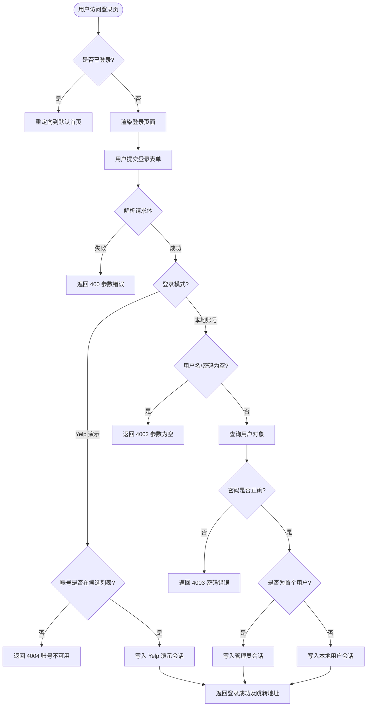

---

#### （2）中文菜品浏览模块

中文菜品浏览模块为用户提供菜品的列表展示、分类筛选、关键词搜索以及详情查看功能。列表页支持按菜系筛选和按名称搜索，并采用分页展示；详情页展示菜品的图片、名称、类型、价格、推荐语、评论列表以及基于 ItemCF 的相似菜品推荐。

**功能说明：**
- **列表页**：`food_list` 视图从 `Foods` 表读取全部菜品，根据 `category` 和 `q` 参数进行筛选，使用 Django `Paginator` 分页，每页 18 条。
- **详情页**：`detail` 视图根据 `foodid` 查询菜品对象与关联评论，同时读取 `data/recommendations/food_itemcf.json` 获取相似菜品候选，经 `similar_foods_for_detail` 服务过滤、去重并回查数据库后返回至多 6 条相似菜品。若用户已登录，还会查询当前用户是否已收藏该菜品。

**图 4-3 中文菜品详情页流程图**

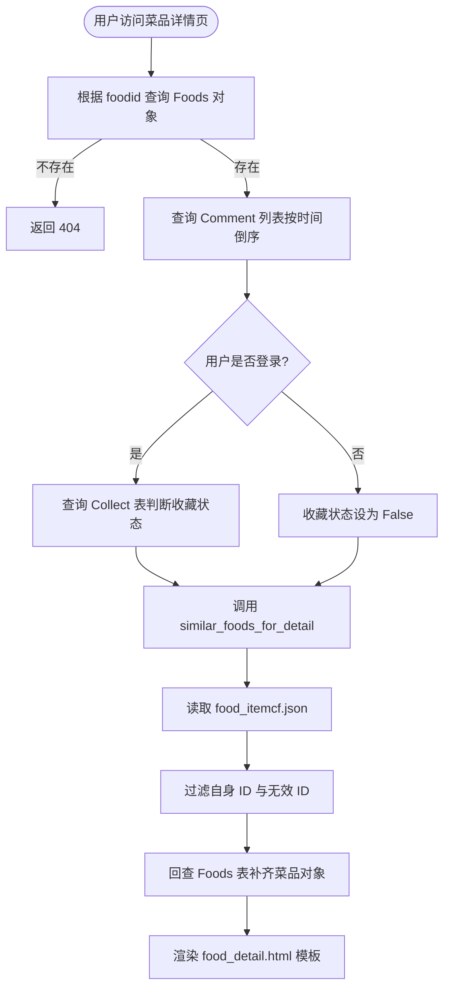

---

#### （3）收藏与评论模块

收藏与评论模块支撑用户对中文菜品的交互行为，是协同过滤推荐的隐式反馈数据源。收藏操作会同步更新 `Foods.collect_count` 字段，评论操作会同步更新 `Foods.comment_count` 字段，以保证统计查询的高效性。

**功能说明：**
- **收藏**：`addcollect` 视图接收 POST 请求，校验用户身份后调用 `Collect.objects.get_or_create()` 创建收藏记录，若创建成功则通过 `F()` 表达式将对应菜品的 `collect_count` 加 1。
- **取消收藏**：`removecollect` 视图删除收藏记录，若删除成功则将对应菜品的 `collect_count` 减 1。
- **发表评论**：`comment` 视图校验评论内容非空后创建 `Comment` 记录，并将对应菜品的 `comment_count` 加 1。

**图 4-4 用户收藏流程图**

```mermaid
flowchart TD
    Start([用户点击收藏按钮]) --> CheckIdentity[校验用户身份 allow_local_user]
    CheckIdentity -->|未登录| Return401[返回 401 未授权]
    CheckIdentity -->|已登录| GetFood[查询目标 Foods 对象]
    GetFood --> CreateCollect[Collect.objects.get_or_create]
    CreateCollect -->|已存在| ReturnSuccess1[返回"已收藏"成功响应]
    CreateCollect -->|新创建| IncCount[Foods.collect_count + 1]
    IncCount --> ReturnSuccess2[返回"收藏成功"响应]
```

---

#### （4）中文菜品推荐模块

中文菜品推荐模块为登录用户提供基于统计的热门推荐以及基于个人收藏行为的协同过滤推荐（ItemCF / UserCF）。由于毕设周期内真实用户行为数据有限，系统提供了 `generate_demo_collects` 管理命令生成演示型收藏数据，用于验证协同过滤链路的工程可行性。

**功能说明：**
- **热门推荐**：`statistics_recommendations` 视图调用 `popular_foods` 与 `most_favorited_foods` 服务，分别按综合排序和收藏数排序返回热门菜品，无需登录即可访问，作为冷启动兜底。
- **UserCF 推荐**：`usercf_recommendations` 视图读取 `food_usercf.json`，通过 `recommend_foods_by_usercf` 服务过滤掉用户已收藏菜品后返回 Top-K 推荐；若结果为空则重定向到首页。
- **ItemCF 推荐**：`recommend_foods_by_itemcf` 服务读取用户最近收藏的菜品 ID 作为种子，查询 `food_itemcf.json` 获取相似候选，再经过去重和回查数据库得到推荐结果，用于详情页和个性化推荐页。

**图 4-5 UserCF 推荐流程图**

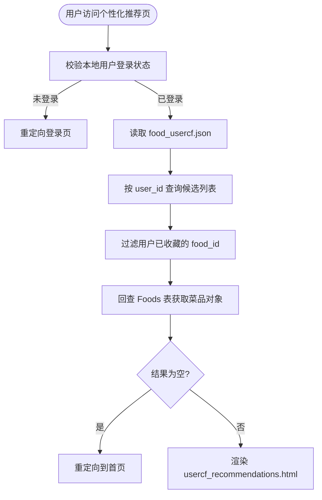

---

#### （5）Yelp 餐厅发现模块

Yelp 餐厅发现模块为用户提供餐厅列表浏览、城市与关键词搜索、营业状态筛选、餐厅详情查看以及本地评分提交功能。该模块的数据来源于 Yelp 公开数据集导入，经过过滤后仅保留餐厅类商家。

**功能说明：**
- **餐厅列表**：`yelp_business_list` 视图调用 `YelpService.list_businesses`，支持按名称/类别/城市关键词搜索、按城市精确匹配以及仅显示营业中商家的筛选，结果按 `review_count`、`stars`、`name` 排序并分页。
- **餐厅详情**：`yelp_business_detail` 视图查询 `YelpBusiness` 对象，调用 `YelpService.get_similar_businesses` 获取基于 TF-IDF 内容相似度的相似餐厅（Top 6），并调用 `get_recent_reviews` 获取最近 5 条评论。
- **提交评分**：`submit_yelp_review` 视图校验评分范围（1~5 星）后，调用 `YelpService.create_local_review` 创建来源标记为 `local` 的评论，并增量刷新该餐厅的 `aggregated_review_count`。

**图 4-6 提交 Yelp 评分流程图**

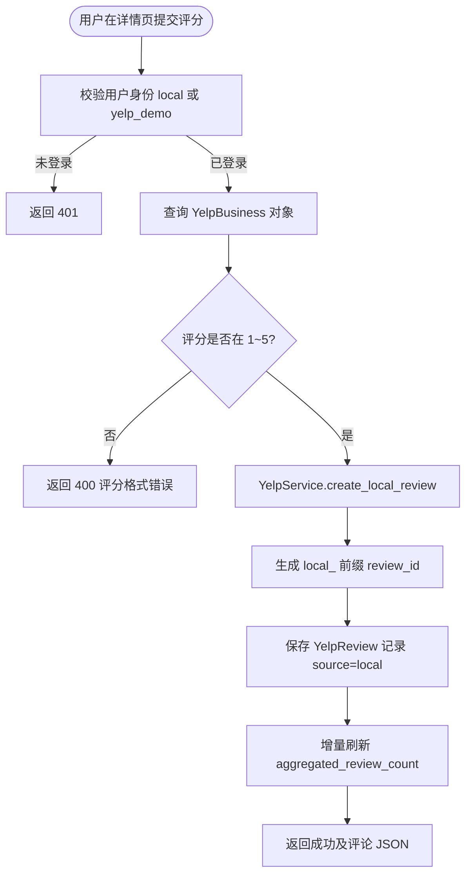

---

#### （6）Yelp 个性化推荐模块

Yelp 个性化推荐模块是系统的推荐能力展示核心。主推荐链路采用"近期行为提取 → 离线内容相似候选重排 → 热门兜底"的三段式策略，同时保留了 ALS 实验推荐页作为大数据模型能力的独立展示入口。

**功能说明：**
- **主推荐页**：`yelp_recommendations` 视图调用 `YelpService.get_recent_recommendations`。该服务先查询用户最近评分过的餐厅 ID（去重，默认取最近 8 条），以这些餐厅为种子读取 `yelp_content_itemcf.json` 获取相似候选；`rerank_from_recent_items` 按时间衰减加权合并候选；最后叠加 popularity score 进行混排。若用户近期无评分记录，则回退到 `get_popular_recommendations` 热门推荐。
- **热门推荐页**：`yelp_hot_recommendations` 视图展示 Spark 离线统计的热门榜单、城市 Top 榜以及月度评论趋势数据，数据来源为 `yelp_spark_hot.json`、`yelp_spark_city_top.json` 和 `yelp_spark_monthly_stats.json`。
- **ALS 实验页**：`yelp_als_recommendations` 视图通过用户 `external_user_id` 查询 `yelp_als_userrec.json`，返回 Spark ALS 离线训练的推荐结果；若该用户无 ALS 结果则回退到热门推荐。

**图 4-7 Yelp 主推荐流程图**

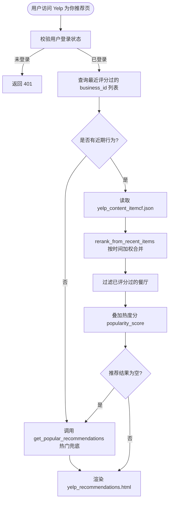

---

### 4.2.2 管理员模块

#### （7）后台管理模块

后台管理模块为系统管理员提供对用户、中文菜品、收藏、评论以及 Yelp 商家和评论的完整 CRUD 管理能力。该模块没有直接复用 Django 自带的 admin 界面，而是通过自定义视图和表单实现了更符合本系统需求的管理后台。

**功能说明：**
- **仪表盘**：`admin_home` 视图统计各核心表的记录数量，以卡片形式展示用户总数、菜品总数、收藏数、评论数、Yelp 商家数与 Yelp 评论数。
- **资源列表页**：统一的 `_render_list` 函数根据 `ResourceConfig` 配置渲染带分页、搜索筛选和编辑删除入口的列表页。
- **资源表单页**：统一的 `_render_form` 函数处理新增与编辑，支持表单验证与保存。对于收藏和评论的增删改，会自动同步关联菜品的 `collect_count` 与 `comment_count`。
- **数据采集页**：`food_ingestion` 视图提供爬虫抓取（写入 CSV）、CSV 导入 Foods 表以及删除 CSV 文件三个操作入口。

**图 4-8 管理员删除资源流程图**

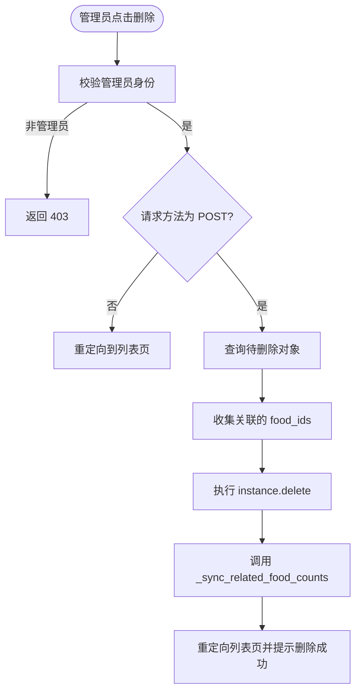

---

#### （8）数据可视化模块

数据可视化模块为管理员提供系统运行数据的多维度图表展示，包括中文菜品词云、Yelp 评论词云、菜品分类统计、用户行为趋势、餐厅地理分布以及菜品相似度网络图。所有图表数据均由 `ChartService` 提供，通过 ECharts 在前端渲染。

**功能说明：**
- **词云图**：首页 `user_index` 视图通过 `HomeWordCloudService` 判断离线词云图片是否存在，模板据此渲染入口；点击后通过 `home_wordcloud_image` 返回 PNG 图片文件。
- **分类统计 API**：`ChartView.food_category_stats` 返回各菜系的平均价格和平均收藏数。
- **用户趋势 API**：`ChartView.user_activity_trend` 按天统计最近 N 天的用户注册、收藏和评论数量。
- **地理分布 API**：`ChartView.restaurant_geo` 返回 Yelp 餐厅的经纬度、评分和评论数，用于散点地图展示。
- **相似度网络 API**：`ChartView.similarity_network` 读取 `yelp_content_itemcf.json`，按相似度阈值筛选边，补齐节点信息后组装为网络图数据。

**图 4-9 数据可视化请求流程图**

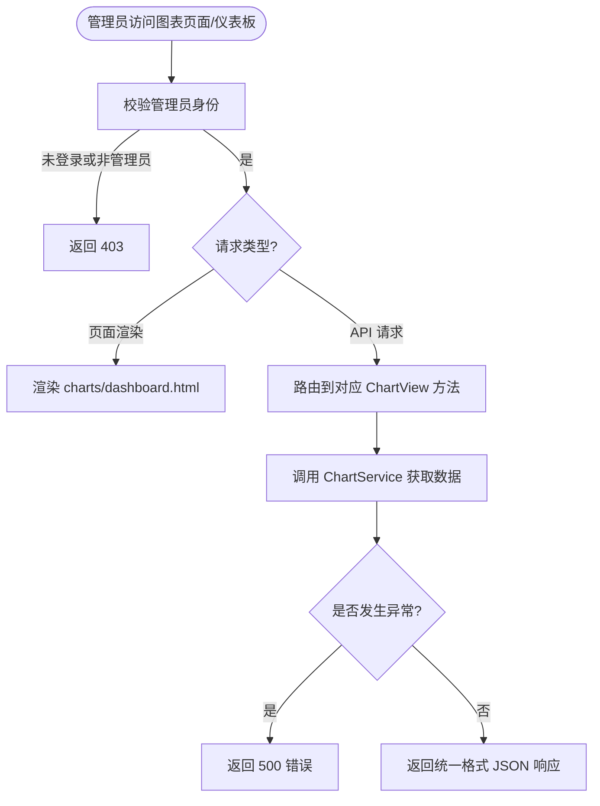

---

## 4.3 数据库设计

### 设计考量与设计说明

本系统的数据库设计围绕以下四个核心考量展开：

1. **统一用户模型，兼容多来源身份**：项目没有为 Yelp 导入用户单独维护一套用户表，而是在 `users.User` 模型中增加了 `source`（区分 `local` 与 `yelp`）和 `external_user_id`（记录外部数据源 ID）两个字段。这样做的价值在于：本地注册用户与导入用户可共用同一套会话与权限逻辑，页面模板和导航无需分叉，Yelp 评论和本地行为也能统一关联到同一张用户表。

2. **双业务线数据隔离，降低耦合**：中文菜品业务与 Yelp 餐厅业务分别使用独立的表集合（`Foods/Collect/Comment` 与 `YelpBusiness/YelpReview`），只在 `User` 表上交汇。这种设计避免了为兼容两条业务线而引入大量可空字段或类型不一致字段，使得各业务线的查询和维护更加清晰。

3. **冗余计数字段，优化在线查询性能**：`Foods` 表中的 `collect_count` 和 `comment_count`，以及 `YelpBusiness` 表中的 `aggregated_review_count`，均属于为查询性能而做的反规范化设计。收藏和评论的增删操作会同步增量更新这些计数字段，从而避免列表页和热门推荐页频繁执行 `COUNT(*)` 聚合查询。

4. **离线产物与在线查询分离**：推荐系统的相似度矩阵、ALS 推荐结果、Spark 统计榜单、词云图片等均不直接存储在 MySQL 中，而是以 JSON 或 PNG 离线产物形式存放在文件系统。在线页面通过 Service 层轻量读取这些产物，数据库仅负责存储业务实体和交互行为，有效控制了表规模和查询复杂度。

### 4.3.1 实体逻辑关系综述

系统数据库的核心实体包括以下六个：

- **User（用户）**：系统的统一身份实体，涵盖本地注册用户与 Yelp 导入用户。一个用户可以拥有多条 Collect（收藏）、多条 Comment（评论）以及多条 YelpReview（Yelp 评分）。
- **Foods（菜品）**：中文菜品实体，记录菜品的基本信息、展示图片、价格以及用于排序的收藏数和评论数。一个菜品可以被多个用户收藏，也可以被多次评论。
- **Collect（收藏）**：用户与菜品之间的多对多关联实体，携带收藏时间。通过 `(user, food)` 联合唯一约束防止重复收藏。
- **Comment（评论）**：用户对菜品的评论记录。当前版本为保持历史兼容性，使用 `uid` 和 `fid` 作为整数引用关联用户和菜品，并建立了对应索引。
- **YelpBusiness（Yelp 商家）**：Yelp 餐厅实体，记录商家的业务 ID、名称、类别、评分、评论数、地理位置及营业状态。`aggregated_review_count` 表示当前系统内实际存储的评论总数，与原始 `review_count` 区分。
- **YelpReview（Yelp 评论）**：用户与 Yelp 商家之间的评分评论实体，通过外键关联 `User` 和 `YelpBusiness`。`source` 字段区分导入的 Yelp 原始评论（`yelp`）与站内用户新增的本地评论（`local`）。

图 4-10 展示了系统六大核心实体之间的总体逻辑关系。

### 图 4-10 系统总体 E-R 图

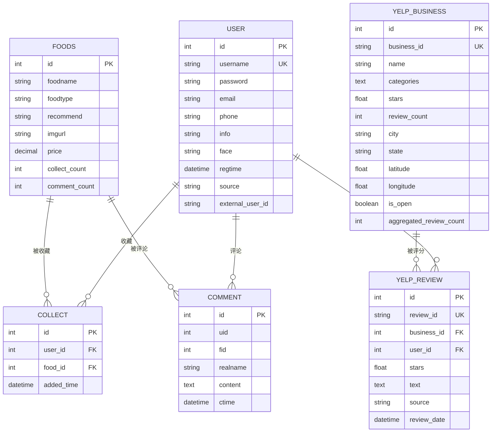

---

### 4.3.2 重要模块的 E-R 图

为更清晰地展示不同业务模块内部的数据关联，以下分别给出用户与中文菜品模块、Yelp 餐厅模块的 E-R 子图。

#### 图 4-11 用户与中文菜品模块 E-R 子图

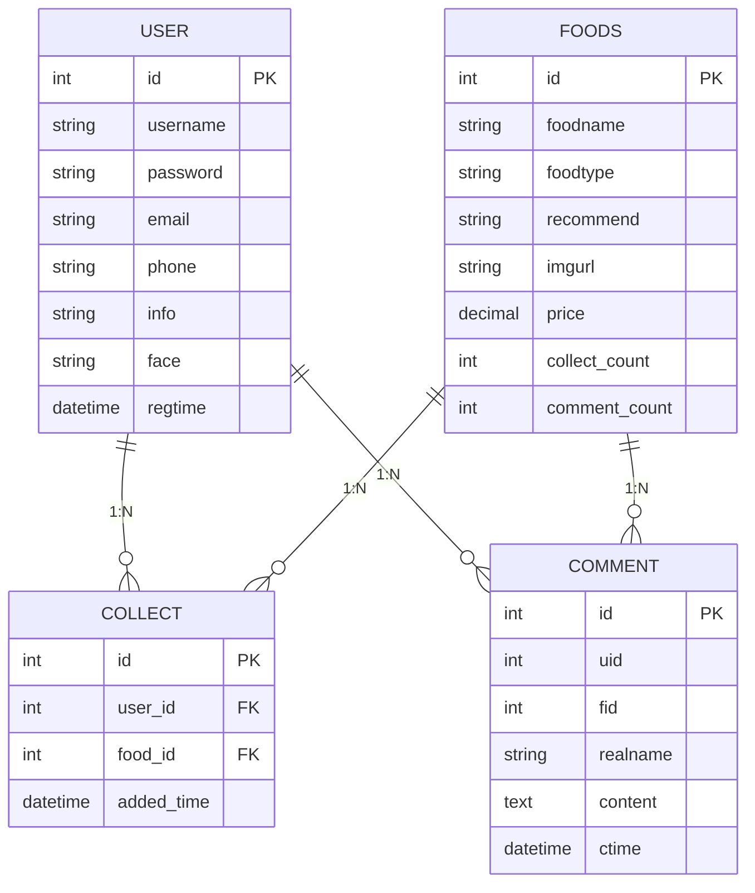

#### 图 4-12 Yelp 餐厅模块 E-R 子图

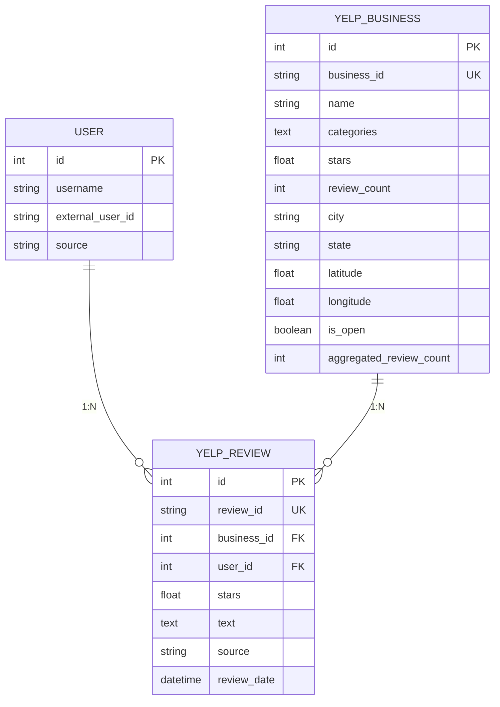

---

### 4.3.3 数据库表设计

下表列出了系统主要数据表的字段说明、数据类型、作用描述及外键关系。

#### 表 4-1 user（用户表）

| 字段名 | 类型 | 作用 | 约束/说明 |
|--------|------|------|-----------|
| id | INT (AutoField) | 用户唯一标识 | 主键，自增 |
| username | VARCHAR(64) | 用户名 | 非空，唯一索引 |
| password | VARCHAR(255) | 加密后的密码 | 非空，PBKDF2 加密 |
| email | VARCHAR(100) | 电子邮箱 | 可空 |
| phone | VARCHAR(11) | 手机号码 | 可空 |
| info | TEXT | 个人简介 | 最大长度 255，可空 |
| face | VARCHAR(255) | 头像 URL | 可空 |
| regtime | DATETIME | 注册时间 | 默认当前时间，db_index |
| source | VARCHAR(20) | 用户来源 | 默认 `local`，db_index |
| external_user_id | VARCHAR(64) | 外部数据源用户 ID | 可空，db_index |

**设计说明**：`source` 和 `external_user_id` 是本表的关键扩展字段，使本地用户与 Yelp 导入用户能在同一模型下共存，避免了维护两套认证体系。`regtime` 建立索引以支持按时间排序的后台查询。

#### 表 4-2 myapp_foods（菜品表）

| 字段名 | 类型 | 作用 | 约束/说明 |
|--------|------|------|-----------|
| id | INT (AutoField) | 菜品唯一标识 | 主键，自增 |
| foodname | VARCHAR(70) | 菜品名称 | 非空 |
| foodtype | VARCHAR(20) | 菜品类型 | 非空，如川菜、粤菜 |
| recommend | VARCHAR(255) | 推荐语 | 可空 |
| imgurl | VARCHAR(255) | 菜品图片 URL | 非空 |
| price | DECIMAL(5,2) | 菜品价格 | 非空 |
| collect_count | INT | 收藏数量 | 默认 0，db_index |
| comment_count | INT | 评论数量 | 默认 0，db_index |

**设计说明**：`collect_count` 和 `comment_count` 是反规范化冗余字段，用于加速热门榜单和排序查询，其数值在 `Collect` 和 `Comment` 的增删操作中被同步维护。

#### 表 4-3 collect（收藏表）

| 字段名 | 类型 | 作用 | 约束/说明 |
|--------|------|------|-----------|
| id | INT (AutoField) | 收藏记录唯一标识 | 主键，自增 |
| user_id | INT | 用户标识 | 外键 → `user(id)`，级联删除 |
| food_id | INT | 菜品标识 | 外键 → `myapp_foods(id)`，级联删除 |
| added_time | DATETIME | 收藏时间 | auto_now_add |

**设计说明**：`(user_id, food_id)` 建立了联合唯一约束，防止同一用户对同一菜品重复收藏。该表是中文菜品协同过滤的隐式反馈数据源。

#### 表 4-4 comment（评论表）

| 字段名 | 类型 | 作用 | 约束/说明 |
|--------|------|------|-----------|
| id | INT (AutoField) | 评论记录唯一标识 | 主键，自增 |
| uid | INT | 用户标识 | 有 `uid` 索引 |
| fid | INT | 菜品标识 | 有 `fid` 索引 |
| realname | VARCHAR(150) | 用户昵称 | 非空 |
| content | TEXT | 评论内容 | 非空 |
| ctime | DATETIME | 评论时间 | 可空 |

**设计说明**：当前版本为保持历史兼容性，`uid` 和 `fid` 使用整型字段而非外键关联。这种设计避免了毕业设计阶段进行大规模数据迁移的风险，同时通过独立索引保证了按用户或菜品查询评论的效率。

#### 表 4-5 yelp_business（Yelp 商家表）

| 字段名 | 类型 | 作用 | 约束/说明 |
|--------|------|------|-----------|
| id | INT (AutoField) | 内部唯一标识 | 主键，自增 |
| business_id | VARCHAR(32) | Yelp 原始商家 ID | 非空，唯一索引 |
| name | VARCHAR(255) | 商家名称 | 非空 |
| categories | TEXT | 类别标签 | 可空，默认空字符串 |
| stars | FLOAT | 平均评分 | 默认 0.0 |
| review_count | INT | 原始评论数 | 默认 0，db_index |
| city | VARCHAR(120) | 城市 | 可空 |
| state | VARCHAR(32) | 州/省 | 可空，db_index |
| latitude | FLOAT | 纬度 | 可空 |
| longitude | FLOAT | 经度 | 可空 |
| is_open | BOOLEAN | 是否营业中 | 默认 True |
| aggregated_review_count | INT | 系统内实际评论数 | 默认 0 |

**设计说明**：`review_count` 保留 Yelp 原始元数据中的评论热度；`aggregated_review_count` 反映当前数据库中实际存储的该商家评论数量，二者分离是为了在展示和推荐重排时使用更准确的可用数据量。`state` 和 `city` 建立复合索引以支持地理位置筛选查询。

#### 表 4-6 yelp_review（Yelp 评论表）

| 字段名 | 类型 | 作用 | 约束/说明 |
|--------|------|------|-----------|
| id | INT (AutoField) | 内部唯一标识 | 主键，自增 |
| review_id | VARCHAR(32) | Yelp 原始评论 ID / 本地生成 ID | 非空，唯一索引 |
| business_id | INT | 商家标识 | 外键 → `yelp_business(id)`，级联删除 |
| user_id | INT | 用户标识 | 外键 → `user(id)`，级联删除 |
| stars | FLOAT | 评分星级 | 默认 0.0 |
| text | TEXT | 评论文本 | 可空 |
| source | VARCHAR(20) | 数据来源 | 默认 `yelp`，db_index |
| review_date | DATETIME | 评论时间 | 可空，db_index |

**设计说明**：`source` 字段用于区分 Yelp 原始导入数据（`yelp`）与站内用户提交的本地评分（`local`），这一设计保证了站内新增评论不会覆盖或混淆原始元数据。`business_id + review_date` 和 `user_id + review_date` 的复合索引分别加速了商家详情页和个人中心的近期评论查询。

---
